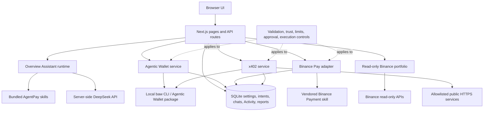

# AgentPay architecture

AgentPay is a standalone Next.js application. The browser presents workflows, but the server is the authority for provider calls, payment policy, approval, signing, execution, persistence, and Activity.

## System view



## Main boundaries

### Browser

The React UI collects user input and displays server results. It does not hold provider credentials, private keys, wallet sessions, payment signatures, or authority to bypass policy.

### Next.js API routes

API routes validate request shapes and connect UI actions to server services. They do not trust model output or browser-provided status values.

### AgentPay services

- `lib/server/agentic-wallet.ts` invokes the local `baw` CLI and normalizes wallet data.
- `lib/server/binance-pay.ts` invokes the pinned Binance Payment skill in a serialized server-side queue.
- `lib/server/binance-readonly.ts` signs read-only Binance account requests and isolates source failures.
- `lib/server/x402.ts` validates public endpoints, fetches live 402 requirements, coordinates wallet preview/signing, replays once, and validates the delivered response.
- `lib/server/overview-agent.ts` selects a bundled skill and delegates deterministic operations to these services.

### Persistence

SQLite stores application settings, payment intents, Binance Pay orders, x402 intents, conversations, and normalized Activity. Provider secrets and payment signatures are not stored in SQLite.

## Payment lifecycle

All outgoing rails follow the same security shape:

```text
Prepare
  → validate current provider data
  → enforce trust and spending policy
  → show exact review
  → explicit approval
  → re-read policy and intent
  → sign or submit once
  → reconcile provider status
  → project one durable Activity record
```

The master emergency stop and individual rail controls are server-checked. A model response, UI setting, or conversation cannot bypass them.

## Skills and provider adapters

AgentPay's `skills/` directory describes how the Assistant should interpret each domain. Those instructions are bounded by server-side schemas and deterministic services. They are not credential holders or execution authorities.

The official Binance Agentic Wallet capability is installed as an npm dependency and invoked through `node_modules/.bin/baw`. The official Binance Payment skill is vendored under `vendor/binance/payment` with its upstream commit recorded in `VENDORED.md`. Keeping the adapter boundary server-side lets AgentPay add policy, persistence, error handling, and safe defaults without modifying the upstream payment runtime.

## Deployment boundary

The current application is a single-user integration. The server must have:

- persistent SQLite storage;
- the persistent Agentic Wallet CLI session;
- server-only provider credentials;
- protected environment configuration;
- restricted network exposure.

A stateless frontend host alone is not sufficient for the current architecture.
